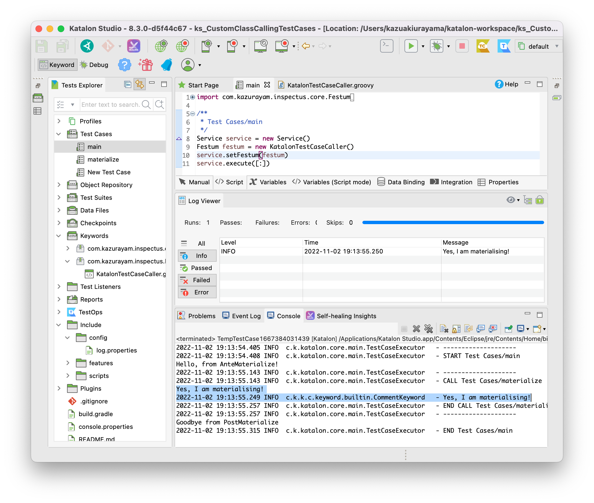

#

## Problem to solve

I want to do this:

1. Katalon Studio runs Katalon TestCase "main".
2. main calls a class "Inspectus".
3. Inspectus calls a sub class "AnteFestum".
4. Inspectus calls another Katalon TestCase "materialize".
5. Inspectus calls a sub class "PostFestum".

Is the 4 possible?

How can the CustomClassX calls another TestCaseB?

## Solution.

I want the CustomClassX to do the same processing as the `WebUI.callTestCase` keyword. Let me try it in this project.

Source of [com.kms.katalon.core.keyword.BuiltinKeyword#callTestCase](https://api-docs.katalon.com/com/kms/katalon/core/keyword/BuiltinKeywords.html#callTestCase(com.kms.katalon.core.testcase.TestCase,%20java.util.Map))

```
    /**
     * Call and execute another test case
     * @param calledTestCase
     *      represents a test case
     * @param binding
     *      contains variables bindings for the called test case.
     *      If the <code>binding<code> parameter is null, default values of all variables are used.
     * @param flowControl
     * @return returned value of called test case
     * @throws Exception
     */
    @CompileStatic
    @Keyword(keywordObject = StringConstants.KW_CATEGORIZE_UTILITIES)
    public static Object callTestCase(TestCase calledTestCase, Map binding, FailureHandling flowControl) throws Exception {
        return (Object)KeywordExecutor.executeKeywordForPlatform(KeywordExecutor.PLATFORM_BUILT_IN, "callTestCase", calledTestCase, binding, flowControl)
    }

```

I should be possible to mimic this using Java Reflection API so that
my Java API can run Katalon Test Case without Katalon's jar at the compile time;
run it with Katalon's jar only at the runtime.


## Description

How to run a demonstration.

You can run `Test Cases/main`:

```
import com.kazurayam.inspectus.core.Festum
import com.kazurayam.inspectus.core.Service
import com.kazurayam.inspectus.katalon.KatalonTestCaseCaller

/**
 * Test Cases/main
 */
Service service = new Service()
Festum festum = new KatalonTestCaseCaller()
service.setFestum(festum)
service.execute([:])
```

The `Service#execute()` does `Preprocess` + `call a TestCase` + `Postprocess`:

```
	public void execute(Map<String, Object> parameters) {
		if (festum == null) {
			throw new InspectusException("festum must not be null")
		}

		// ante festum
		AnteFestum ante = new AnteMaterialize();
		ante.preprocess([:])

		// in festum
		festum.call("Test Cases/materialize", [:])

		// post festum
		PostFestum post = new PostMaterialize();
		post.postprocess([:])
	}
```

So, the Test Case `Test Cases/materialize` is called, which does a simple task:

```
import com.kms.katalon.core.webui.keyword.WebUiBuiltInKeywords as WebUI

String msg = "Yes, I am materialising!"

println msg
WebUI.comment(msg)
```

When I run the `Test Cases/main`, I saw the following output:



The `execute()` method of the `Service` object successfully called a Katalon Test Case `materialize`.

